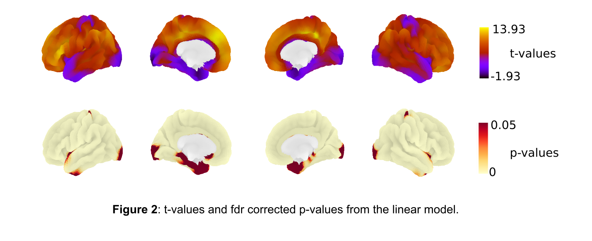

# OHBM Hackathon 2021 TrainTrack Session - Reproducible Workflows

Welcome to the code and content repository of the hands-on session ***"I’d like to reproduce your results…" and other tales in Reproducible Workflows***, part of the TrainTrack of the [OHBM BrainHack 2021](https://ohbm.github.io/hackathon2021/traintrack/)

---
### Presenters:
[Stephan Heunis](https://github.com/jsheunis) and [Şeyma Bayrak](https://github.com/sheyma)

---

## Abstract

Almost all researchers have data and analysis scripts that generate results in the form of figures. Yet, few other researchers can use these exact data and scripts to generate the same figures, or to reproduce all results of the study. In this session, we’ll take you on a journey of building reproducible workflows that help alleviate the anxiety associated with receiving that dreaded email *'I’d like to reproduce your results...'*

We’ll start with helping others run your code on their machines, and end up with a fully reproducible workflow running in the cloud, with several pit stops in between.

## Scenario

As a researcher working in neuroimage analysis, you (the person following this hands-on session) have recently published a paper using cortical thickness data from [MICA-MNI](https://github.com/MICA-MNI/micaopen/tree/master/surfstat/surfstat_tutorial/thickness).

Your paper described an analysis pipeline to compare the thickness in various brain regions for a group of 259 participants, and your results section contains several figures including a visualization of statistical test values.



You receive an email from a colleague asking if you can send them the necessary code, data and instructions to reproduce these results.

## Goals

By the end of this session, you should be able to do the following STEPS:

1. Set up a `requirements.txt` file that specifies package requirements
2. Specify and set up a virtual environment to install requirements
3. Share code, installation, and running instructions via GitHub
4. Transform your code into a Jupyter notebook
5. Set up your code repository to run in the cloud with Binder
6. Understand how containers can play a role in this context
7. Understand the benefits of data management with DataLad


## Slides

The sessions follows [**these slides**](https://ohbm.github.io/handson-2021-reproducible-workflows/presentation/ohbm-handson-repro.html) step by step.

## Computational environment

Some parts of the session will be run in a Binder-based computational environment in the cloud.

One environment demonstrates the use of `requirements.txt` as the configuration file for Binder. Access it here:

[](https://mybinder.org/v2/gh/ohbm/handson-2021-reproducible-workflows/HEAD)

Another environment demonstrates the use of `environment.yml` as the configuration file for Binder. Access it here:

[](https://mybinder.org/v2/gh/ohbm/handson-2021-reproducible-workflows/conda-env)

The latter environment builds from the [`conda-env` branch](https://github.com/ohbm/handson-2021-reproducible-workflows/tree/conda-env).

## Local installation

If you'd like to install the full repository (code, data, confirguration files, presentation slides, etc) on your machine, please follow these instructions:


### 1. Install required system level apps

These are listed in `apt.txt`

### 2. Clone the repository

```
git clone https://github.com/ohbm/handson-2021-reproducible-workflows.git
```

### 3. Create a virtual environment

With `virtualenv`:
```
pip install virtualenv
virtualenv --python=python3.6 mypythonenv
source mypythonenv/bin/activate
```

With `conda`:
```
# First install miniconda: https://docs.conda.io/en/latest/miniconda.html
conda create -n mypythonenv python=3.6
conda activate mypythonenv
```

### 4. Install dependencies

With `pip` and `requirements.txt` (`main` branch):

```
pip install -r requirements.txt
```

With `conda` and `environment.yml` (`conda-env` branch)
```
conda env create -f environment.yml
```

Additional dependencies can only be installed as follows:

```
git clone https://github.com/MICA-MNI/BrainStat.git
cd BrainStat
python3 setup.py build
python3 setup.py install --user
```
